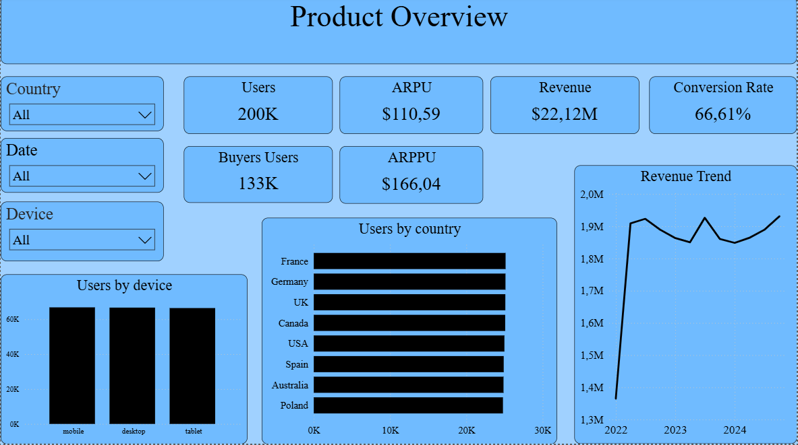
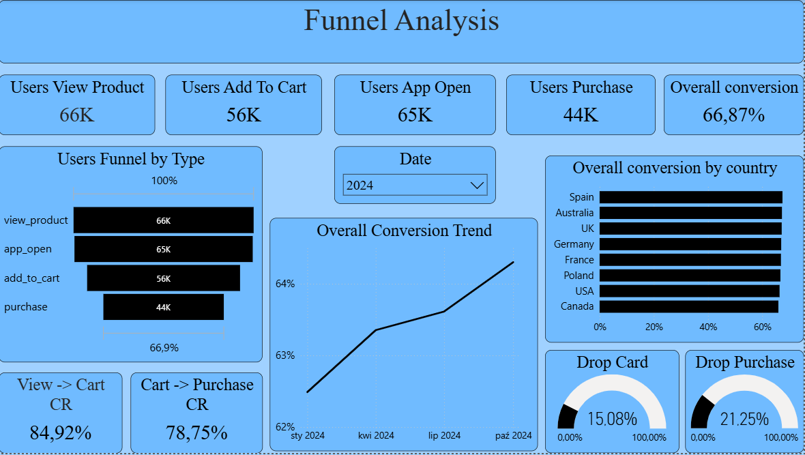
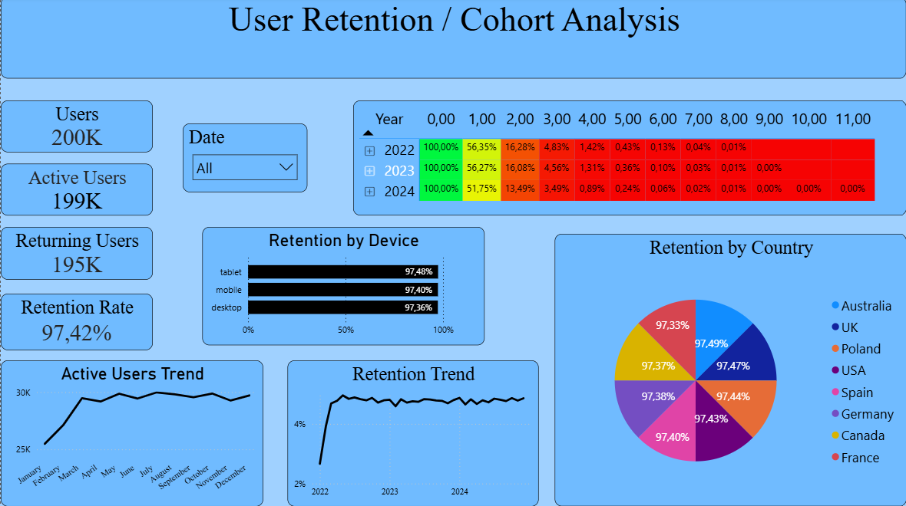
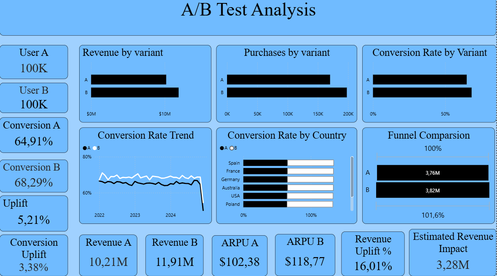
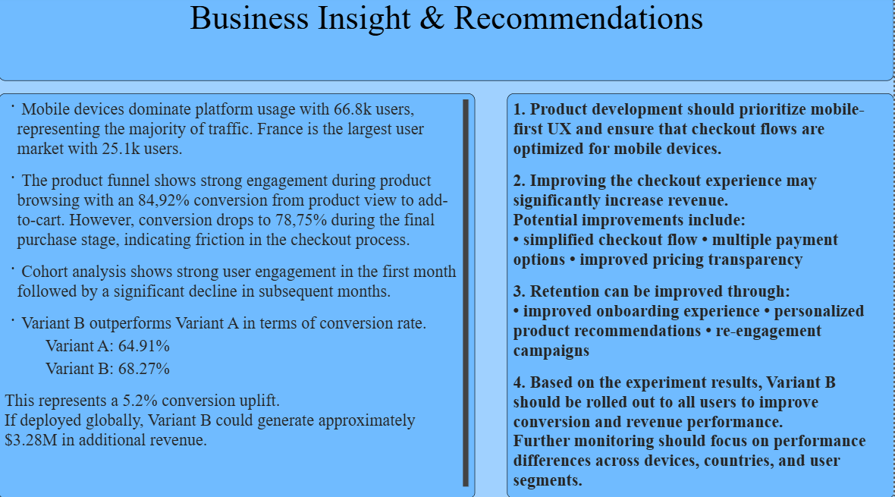

# e-commerce-A-B-testing

## Project Overview

This project analyzes user behavior within a simulated digital product environment to identify opportunities for improving conversion, retention, and revenue.
The analysis focuses on understanding how users interact with the product funnel, how user engagement evolves over time, and whether a new product variant improves business performance.
The project simulates a real-world product analytics workflow, similar to what data analysts and product analysts perform in technology companies.

The analysis includes:
- product funnel analysis
- cohort-based retention analysis
- monetization metrics (ARPU, ARPPU)
A/B testing evaluation
estimation of revenue impact from product changes

The goal of the project is to demonstrate how data-driven experimentation and behavioral analytics can support product decisions and revenue growth.

## Business Questions

1. The project aims to answer the following questions:
2. Where do users drop off in the product funnel?
3. Which user segments generate the most traffic?
4. How does user retention evolve over time?
5. Does the new product variant improve conversion performance?
6. What is the estimated revenue impact of deploying the new variant?

Data Generation
The dataset used in this project was synthetically generated to simulate realistic product usage patterns.
The dataset contains approximately:
- 200,000 users
- 7.5 million user events
- 368,000 purchases

The simulated product funnel consists of the following behavioral events:

app_open → view_product → add_to_cart → purchase

This structure enables realistic analysis of user behavior and product conversion performance.

## Data Model
### The project uses three core tables.

#### Users
Column	Description:
- user_id	(unique user identifier)
- singup_date	(user registration date)
- country	(user country)
- device	(device type mobile / desktop)
- ab_variant	(experiment variant A / B)

#### Events
Column	Description:
- event_id	(unique event identifier)
- user_id	user (performing the event)
- event_type	(type of interaction)
- event_date	(timestamp of the event)

Event types include:
- app_open
- view_product
- add_to_cart
- purchase

#### Purchases
Column	Description:
- purchase_id	(purchase identifier)
- user_id	user (making the purchase)
- product_id	(purchased product)
- revenue	(revenue generated by purchase)
- purchase_date	(purchase timestamp)

This table enables revenue analysis and monetization metrics.

## Technology Stack

The project uses tools commonly applied in modern data analytics workflows.

- Python – synthetic dataset generation
- PostgreSQL – data storage and SQL transformations
- SQL – behavioral data modeling and aggregation
- DAX – business metric calculations
- Power BI – interactive dashboard and visualization


## Data Pipeline

The project follows a structured analytical workflow.

#### 1. Data Generation
A synthetic dataset was created to simulate realistic user behavior patterns in a digital product environment.
The generated dataset includes:
- user demographic attributes
- product interaction events
- purchase transactions
A/B experiment assignments

#### 2. Data Storage

The generated datasets were exported to CSV files and loaded into PostgreSQL.
Main tables:
- users
- events
- purchases
Indexes were created to improve query performance.

Example:
###### 1. CREATE INDEX idx_events_user_id ON events(user_id);
###### 2. CREATE INDEX idx_events_date ON events(event_date);
###### 3. CREATE INDEX idx_purchases_user_id ON purchases(user_id);

#### 3. SQL Data Transformation

SQL was used to prepare analytical views that support behavioral analysis.
Funnel preparation
Events were aggregated to calculate the number of users reaching each step of the product funnel.
Example logic:
app_open → view_product → add_to_cart → purchase

This enables calculation of:
- step conversion rates
- funnel drop-off
- user behavior patterns

## Cohort analysis preparation

Users were grouped into monthly cohorts based on registration date.
The analysis tracks how user activity evolves across months since registration.

Key steps:
- assign cohort month to each user
- track monthly user activity
- calculate cohort age
- aggregate active users per cohort

This enables retention analysis and engagement tracking.

## A/B test preparation

The dataset contains an experiment variable:
- ab_variant (A / B)

This enables comparison between variants across:
- conversion rate
- revenue per user
- funnel performance
  
## Power BI Data Model

The transformed SQL tables were imported into Power BI.

Relationships were created using:
- user_id
- date fields

This allows dynamic filtering using slicers such as:
- date
- country
- device


## Architecture Diagram 

                                              CSV Data (Python Faker)
                                                         ↓
                                                PostgreSQL Database
                                                         ↓
                                                 SQL View,Indexes
                                                         ↓
                                       Power BI Semantic Layer (DAX Measures)
                                                         ↓
                                      Interactive Dashboards & Business Insights


## Power BI Dashboard – Preview

### 1. Product Overview


### 2. Funnel Analysis


### 3. User Retention / Cohort Analysis


### 4. A/B Test Analyst


### 5. Business Insights & Recommendations



## Project Structure

```text
e-commerce-A-B-testing/
│
├── README.md                  ← Project overview (for recruiters)
│
├── sql/
│   ├── 01_funnel_events.sql
│   ├── 02_user_funnel_model.sql
│   ├── 03_revenue_per_user.sql
│   ├── 04_user_metrics_dataset.sql
│   ├── 05_cohort_assignment.sql
│   ├── 06_user_activity_tracking.sql
│   ├── 07_cohort_activity.sql
│   ├── 08_cohort_retention_dataset.sql
│   ├── 09_ab_test_summary.sql
│   ├── 10_conversion_dataset.sql
│   └── informations.md              ← SQL logic explained
│
├── dax/
│   ├── 01_product_overwiev.dax
│   ├── 02_funnel_analysis.png
│   ├── 03_user_retention_cohort_analysis.png
│   ├── 04_ab_test_analysis.png
│   ├── 05_business_insights.png
│   └── informations.md              ← DAX measures explained
│
├── powerbi/
│     ├── 01_product_overwiev.png
│     ├── 02_funnel_analysis.png
│     ├── 03_user_retention_cohort_analysis.png
│     ├── 04_ab_test_analysis.png
│     └── 05_business_insights.png
│
├── insights/
│   └── insights_and_recommendations.md
│
└── assumptions_and_limitations.md
    └── informations.md

